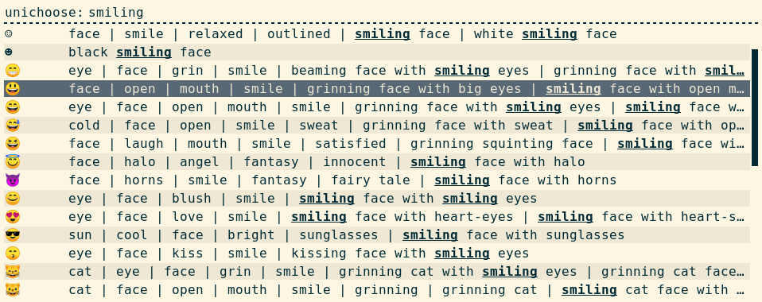

unichoose is a simple Unicode character selector built on top of [Rofi](https://github.com/davatorium/rofi).

# Getting started

Requirements,

* `python3`
* `rofi`
* `curl` (setup only)
* `make` (setup only)
* `unzip` (setup only)

Setup,

```
git clone https://github.com/c2nes/unichoose
cd unichoose
make
```

Usage,

``` shellsession
# Try entering "smiling" and choose "SMILING FACE WITH OPEN MOUTH"
$ ./unichoose
😃
```

Screen shot,



